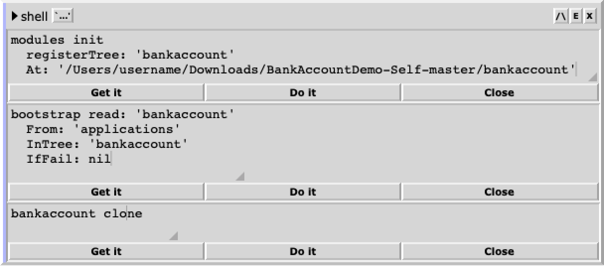
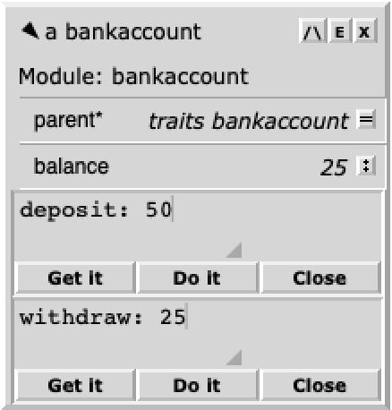

"[Self] was first used as an experimental test system for language design in the 1980s and 1990s. ... Self was designed mostly by [David Ungar](https://en.wikipedia.org/wiki/David_Ungar) and [Randall Smith](https://labs.oracle.com/pls/apex/f?p=labs:bio:0:118) in 1986 while working at Xerox PARC. Their objective was to push forward the state of the art in object-oriented programming language research..." *— [Wikipedia](https://en.wikipedia.org/wiki/Self_(programming_language))*

- - -

BankAccountDemo-Self
====================

**Source code for [Chris Double's](https://bluishcoder.co.nz/) [Self Demo: Creating a bank account object](https://www.youtube.com/watch?v=5Jhi5yN9S1o).**

* [Self "Mandarin" 2017.1](http://www.selflanguage.org/) reference platform.

## Installation

(For steps 3-5, see the screenshot's _shell_ object.)

1. Install and setup [Self](http://www.selflanguage.org/).
2. Download this project.
3. Via a Self shell, _Do it_:

    ```self
    modules init
      registerTree: 'bankaccount'
      At: '/Users/username/Downloads/BankAccountDemo-Self-master/bankaccount'
    ```
    Note: Use the correct "At:" path to the "bankaccount" directory in this project.

4. Next, _Do it_:

    ```self
    bootstrap read: 'bankaccount'
      From: 'applications'
      InTree: 'bankaccount'
      IfFail: nil
    ```

5. Lastly, _Get it_:

    ```self
    bankaccount clone
    ```

## Example Usage

(See the screenshot's _bankaccount_ object.)

Via a _bankaccount_ object, _Do it_:

```self
deposit: 50
```

```self
withdraw: 25
```

## Screenshot





## Acknowledgements

* [Chris Double](https://bluishcoder.co.nz/) for the [Self Demo: Creating a bank account object](https://www.youtube.com/watch?v=5Jhi5yN9S1o) presentation.
* [Russell Allen](https://github.com/russellallen) and [contributors](https://github.com/russellallen/self/graphs/contributors) for [Self](http://www.selflanguage.org), the prototype-based dynamic object-oriented programming language, environment, and virtual machine centered around the principles of simplicity, uniformity, concreteness, and liveness.

## Author

[brackendev](https://www.github.com/brackendev)

## License

BankAccountDemo-Self is released under the MIT license. See the LICENSE file for more info.

- - -

## Useful Links

* [Bystroushaak's Self series](http://blog.rfox.eu/Bystroushaak%20s%20blog/English%20section/Series%20about%20Self.html)
* [Self and Self: Whys and Wherefores](https://www.youtube.com/watch?v=3ka4KY7TMTU)
* [Self: The Movie](https://www.youtube.com/watch?v=Ox5P7QyL774)
* [selflanguage.org](http://www.selflanguage.org)
